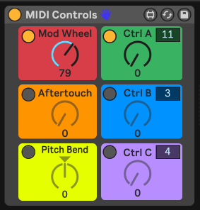
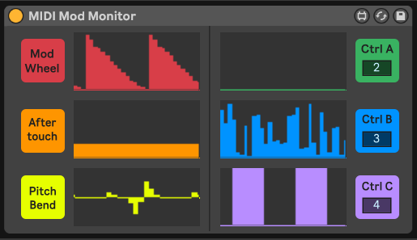
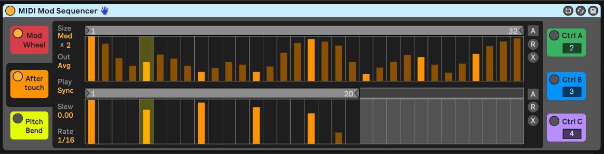
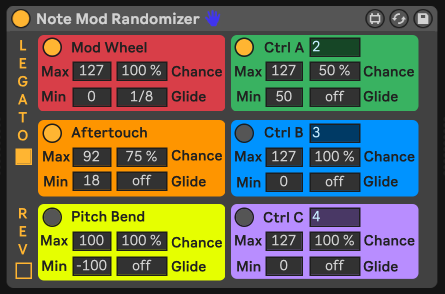

# Ableton MIDI Modulation Tools

A collection of Ableton Live MIDI Effect devices for working with MIDI modulation.

## Installation

* [Download version 1.0](https://github.com/adamjmurray/ableton-midi-modulation-tools/archive/1.0.zip)
* Unzip and put the folder wherever you want. Keep the files together because some devices will not work without other files in the folder.

## Features

* 6 color-coded modulation sources: mod wheel, aftertouch, pitch bend, and 3 freely assignable "CC" controls.
* Independently enable each modulation source.
* Automate nearly everything (except the sequencer).
* Hover over any control for help in Live's Info View.

### MIDI Controls

* Control the 6 modulation sources with virtual knobs.
* Pass through the modulation source when disabled.
* Automate MIDI modulation in the Arrangement.

### MIDI Mod Monitor

* Monitor incoming MIDI modulations visually.
* Pass through all MIDI.

### MIDI Mod Sequencer

* Independent step sequencers at a variety of clock-syned speeds for each modulation source.
* Up to 64 steps per sequencer.
* Up to 3 step patterns per sequencer with independent loop points for polyrhythms and pseudo-random patterns.
* Multiple output modes combine the 3 step patterns in various ways: average, min, max, or random.
* 3 playback modes: sync to the transport, re-trigger on each note, or one shot playback.
* Slew control to smooth the output and glide between step values.
* Randomization and auto-randomization

### Note Mod Randomizer

* Randomized modulation for every note.
* Control the minimum and maximum value of each modulation source.
* Set the chance to randomize the value of each note.
* Glide to the new value at a variety of speeds.
* Reverse glide from the new value back to the current value to create more contrast between notes.
* Optional legato randomizes values only on the first note of overlapping notes (useful for chords).

## Tips

### Compatibility

Note that Live's MIDI mappings only work with external MIDI sources like hardware, so you cannot map these devices to arbitrary parameters. The instrument must support MIDI modulation, which most plugin instruments do.

The following built-in Live instruments support MIDI modulation:

* Collision: mod wheel, aftertouch, and pitch bend
* Operator: mod wheel, aftertouch, and pitch bend
* Sampler: mod wheel, aftertouch, pitch bend, and custom controller 4 ("foot ctrl")
* Wavetable: mod wheel ("Mod"), aftertouch ("AT"), and pitch bend ("PB")

Most of Live's instruments respond to pitch bend. The ones listed above can modulate things besides pitch with the pitch bend.

### Control Numbers

Here are common control numbers for the customizable controls:
* 2: breath controller
* 4: foot controller (supported by Live's Sampler)
* 11: expression controller
* 64: sustain pedal

A plugin might refer to these by name instead of number.
